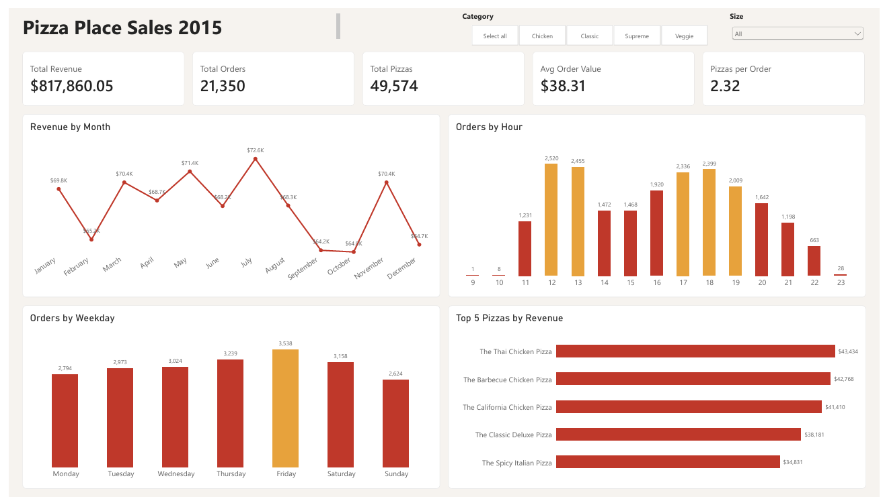

# README

# Pizza Place Sales Analysis

An end-to-end data analysis project: raw CSV files, loaded and cleaned in **SQL Server**, analyzed with **T-SQL**, and presented in a **Power BI** dashboard.

Dashboard



Dashboard

## Business questions

1. How do revenue and orders change from month to month?
2. Which hours of the day are the busiest?
3. Which days of the week are the strongest and the weakest?
4. Which pizzas sell the most and the least?
5. Which sizes and categories drive the most revenue?
6. How big is the average order (pizzas and dollars)?
7. Which pizzas lead each category?

## Data

- **Source:** [Pizza Place Sales](https://mavenanalytics.io/data-playground/pizza-place-sales) from Maven Analytics (a fictional pizza restaurant, calendar year 2015). Please check the dataset license before reusing it.
- **Files:** `orders` (21,350 rows), `order_details` (48,620 rows), `pizzas` (96 rows), `pizza_types` (32 rows).
- The raw CSV files are not included in this repository. Download them from the link above.

## Tools

SQL Server (T-SQL), SQL Server Management Studio, Power BI Desktop (DAX).

## Workflow

| Step | File | What it does |
| --- | --- | --- |
| 1 | `sql/01_setup_load_check.sql` | Creates the database and staging tables (all text columns), loads the CSV files with `BULK INSERT`, and runs data quality checks |
| 2 | `sql/02_clean.sql` | Builds typed, constrained `*_clean` tables from the staging tables |
| 3 | `sql/03_analysis.sql` | Answers the business questions, with a short comment under each query |
| 4 | `sql/04_views.sql` | Creates a fact view and two dimension views for Power BI (star schema) |
| 5 | `PizzaPlace_Dashboard.pbix` | The Power BI report built on the views |

## Data quality notes

- After loading, row counts match the source files: 21,350 / 48,620 / 96 / 32.
- One encoding problem was found in `pizza_types.ingredients`: a corrupted character in front of `Nduja Salami`. It affects one row and is repaired in `02_clean.sql` (restored to `'Nduja Salami`).
- `date` and `time` come as two separate columns and are combined into one `order_datetime` column.
- Clean tables use primary keys, foreign keys, `NOT NULL`, and `CHECK` constraints (`price > 0`, `quantity > 0`). All rows loaded without violating them, and row counts are identical between staging and clean tables.
- Total revenue is reconciled across layers: **$817,860.05** in the SQL clean tables, in the views, and in the Power BI dashboard.

## Key findings

All figures come from the 2015 data.

1. **Overall:** 21,350 orders, 49,574 pizzas, $817,860.05 revenue. The average order contains 2.32 pizzas and is worth $38.31.
2. **By month:** revenue is fairly stable, between $64,027.60 (October) and $72,557.90 (July), a gap of about 13%. The biggest rise is November (+9.95%) and the biggest drop is December (-8.09%). With only one year of data, seasonality cannot be confirmed.
3. **By hour:** two clear peaks at 12-13h (2,520 and 2,455 orders) and 17-19h (2,336, 2,399 and 2,009 orders). Together they cover about 55% of all orders. Orders dip at 14-15h (about 1,470, roughly 42% below the noon peak). Hours 9, 10 and 23 have only 37 orders in total.
4. **By weekday:** Friday is the strongest day (3,538 orders, 16.6% of the total) and Sunday the weakest (2,624, 12.3%). Friday has about 35% more orders than Sunday, so weekdays vary more than months.
5. **By size and category:** size L brings about 46% of revenue, M about 31%, S about 22%, while XL and XXL together are under 2%. The four categories are close: Classic 26.9%, Supreme 25.5%, Chicken 24.0%, Veggie 23.7%.
6. **Best sellers:** by units, The Classic Deluxe Pizza leads (2,453) and The Brie Carre Pizza is last (490). By revenue, three Chicken pizzas take the top three places (Thai Chicken $43,434; BBQ Chicken $42,768; California Chicken $41,410). Thai Chicken is only 5th by units but 1st by revenue, because its average price per pizza sold is higher.
7. **Order size:** the average order has 2.32 pizzas and $38.31 in revenue.

## Dashboard

One page with five KPI cards (Total Revenue, Total Orders, Total Pizzas, Avg Order Value, Pizzas per Order), four charts (revenue by month, orders by hour, orders by weekday, top 5 pizzas by revenue), and slicers for category and size.

Main DAX measures:

```
Total Revenue    = SUM ( FactSales[line_revenue] )
Total Orders     = DISTINCTCOUNT ( FactSales[order_id] )
Total Pizzas     = SUM ( FactSales[quantity] )
Avg Order Value  = DIVIDE ( [Total Revenue], [Total Orders] )
Pizzas per Order = DIVIDE ( [Total Pizzas], [Total Orders] )
```

## Repository structure

```
pizza-place-sales-analysis/
├── sql/
│   ├── 01_setup_load_check.sql
│   ├── 02_clean.sql
│   ├── 03_analysis.sql
│   └── 04_views.sql
├── images/
│   └── dashboard.png
├── PizzaPlace_Dashboard.pbix
└── README.md
```

## How to reproduce

1. Install SQL Server (Developer or Express) and SQL Server Management Studio.
2. Download the four CSV files from the source link and put them in a folder, for example `C:\Data\Pizza\`.
3. In `01_setup_load_check.sql`, update the file paths in the `BULK INSERT` statements.
4. Run the SQL scripts in order: `01`, `02`, `03`, `04`. Each script can be re-run safely.
5. Check that total revenue equals **$817,860.05**.
6. Open `PizzaPlace_Dashboard.pbix` in Power BI Desktop and update the data source to your own server name (*Transform data > Data source settings*).

## Limitations

- Only one year of data, so seasonal patterns cannot be confirmed.
- The data has revenue but no cost, so no conclusion about profit is possible.
- There are no customer identifiers, so repeat-purchase analysis is not possible.
- Explanations in the SQL comments are hypotheses. The data shows when things happen, not why.

## Author

Vo Tan Tai - taitanvo16@gmail.com
